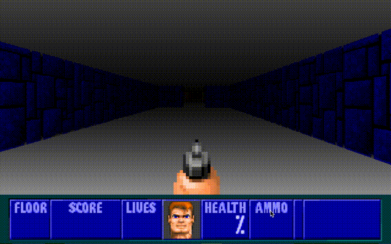

# Rustenstein 3D

Prototype Wolfenstein 3D port written in Rust.
* [Development story](https://tech.nextroll.com/blog/dev/2022/02/02/rustenstein.html)
* [Roadmap](https://github.com/AdRoll/rustenstein/projects/1)

## Setup

This requires the [SDL development library](https://github.com/Rust-SDL2/rust-sdl2#sdl20-development-libraries).

To run the game, it's necessary to include the Wolfenstein data files in the `data/` directory.
This should be from the shareware version, ending in `.WL1` (`GAMEMAPS.WL1`, `VGAGRAPH.WL1`, etc.).
The files can be found, for example, [here](https://archive.org/details/Wolfenstein3d).

Run the game with:

    cargo run --release
